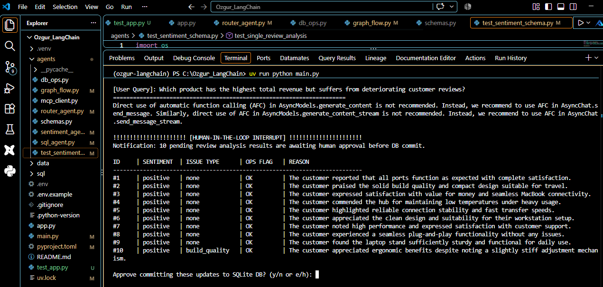
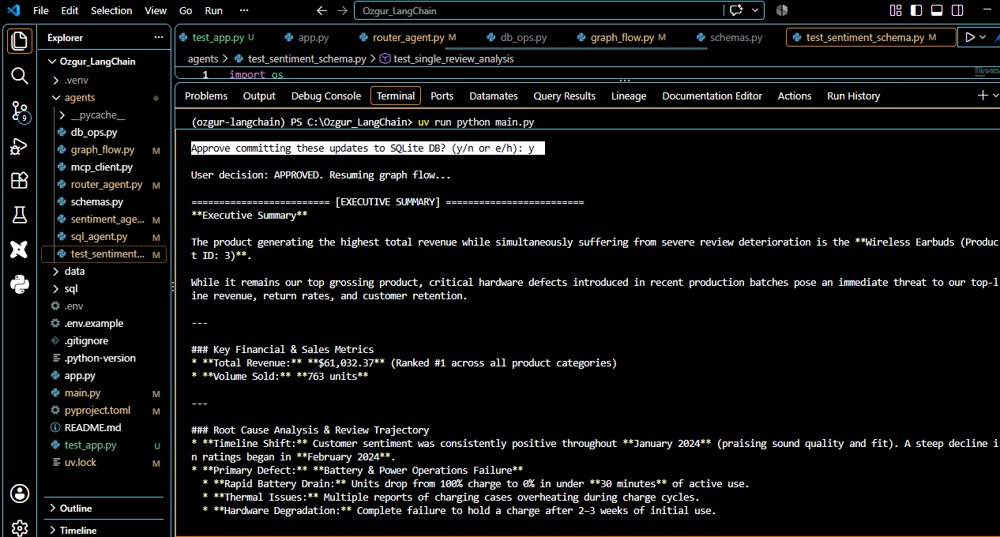
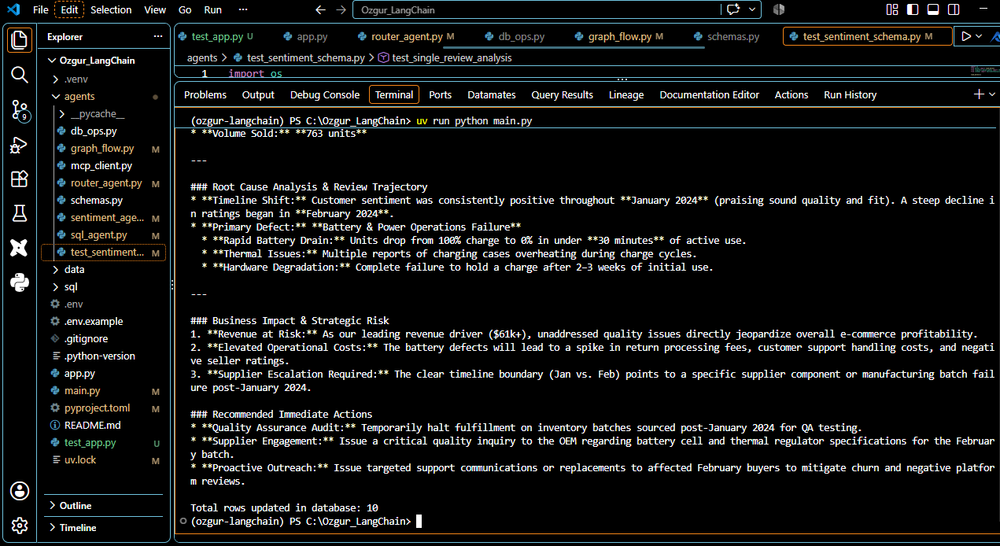

# E-Commerce AI Agent & Analytical BI Platform

### Autonomous Multi-Agent Orchestration with MCP (SQLite), LangGraph HITL, and Terminal CLI

---

## Executive Overview & Business Case

Standard business intelligence dashboards provide aggregate quantitative figures, showing what happened across sales channels, but fail to explain why operational anomalies occur in real time.

This platform combines analytical SQL modeling with an autonomous Multi-Agent architecture to solve a critical e-commerce scenario:

* **Financial Anomaly:** Identifies that **Product #3 (Wireless Earbuds)** is the primary revenue driver ($61k+), while sales drop and customer reviews deteriorate sharply between January and February.
* **Autonomous Root-Cause Diagnostic:** Agents trace customer complaints to an operational failure—specifically, severe battery depletion and thermal overheating during charging.
* **Enterprise Governance (Human-in-the-Loop):** Protects production systems by ensuring that language models cannot execute write mutations (`UPDATE`/`DELETE`) directly. All schema modifications are halted for human validation via LangGraph state interruptions before persistence.
* **Streamlined CLI Interface:** All interactive prompts, review validations, and executive briefs run directly through a deterministic terminal command-line interface (`main.py`).

---

## System Architecture

```text
                    +------------------------------------+
                    |        Interactive Terminal        |
                    |    (main.py User Input Prompt)     |
                    +-----------------+------------------+
                                      |
                                      v
                    +------------------------------------+
                    |            Router Agent            |
                    |    (Pydantic Intent Classifier)    |
                    +-----------------+------------------+
                                      |
         +----------------------------+----------------------------+
         | (sql)                      | (both)                     | (sentiment)
         v                            v                            v
+-----------------------+    +-----------------------+             |
|   SQL Query Agent     |    |   SQL Query Agent     |             |
|  (MCP SQLite Client)  |    |  (MCP SQLite Client)  |             |
+-----------+-----------+    +-----------+-----------+             |
            |                            |                         |
            | (Read Queries)             | (Target Product ID)     |
            v                            v                         |
+-----------------------+    +-----------------------+             |
|   mcp-server-sqlite   |    |    Sentiment Agent    | <-----------+
| (Stdio Isolation)     |    |  (Gemini Batch LLM)   |
+-----------+-----------+    +-----------+-----------+
            |                            |
            | (JSON Rows)                | (Pending Mutations)
            v                            v
+-----------------------+    +-----------------------+
|  SQLite Database      |    |  LangGraph HITL Node  |
| (Analytical Storage)  |    | (interrupt Breakpoint)|
+-----------------------+    +-----------+-----------+
            ^                            |
            | (Authorized UPDATE)        +-------------+
            |                            v             v
            +------------------- [Approve]          [Reject]
                                         |             |
                                         v             v
                             +-----------------------------------+
                             |           Summary Agent           |
                             |      (Executive Synthesis)        |
                             +-----------------+-----------------+
                                               |
                                               v
                             +-----------------------------------+
                             |        Terminal CLI Report        |
                             +-----------------------------------+

```

### Component Breakdown

### 1. Intent Classification (Router Agent)

User queries entered via the terminal are parsed using structured output contracts. The agent dynamically directs flow along three execution branches:

* `sql`: Strictly quantitative queries (revenue, units sold, margins).
* `sentiment`: Qualitative customer feedback, ratings, and defect descriptions.
* `both`: End-to-end diagnostic blending financial trajectories with qualitative root causes.

### 2. Standardized Database Interfacing via MCP (SQL Agent)

Rather than relying on raw SQL strings or exposing administrative write access to LLMs, the system strictly interfaces with SQLite through the **Model Context Protocol (MCP)** using `mcp-server-sqlite`:

* **Transport:** Asynchronous standard input/output (Stdio).
* **Isolation:** The agent has access to schema inspection (`list_tables`, `describe_table`) and read-only query execution (`read_query`). Direct database mutations are inaccessible.

### 3. Structured Data Extraction (Sentiment Agent)

Unprocessed reviews are processed in batches using Pydantic validation models:

* Sentiment classification (`positive`, `negative`, `neutral`).
* Issue category mapping (`battery`, `charging`, `ergonomics`, `build_quality`, `sound_quality`, `none`).
* Operational tagging (`flagged_for_ops: bool`) accompanied by diagnostic justification.

### 4. Human-in-the-Loop Governance (LangGraph Workflow)

Production pipelines require deterministic human control over data mutations. The orchestration graph relies on LangGraph checkpointing (`MemorySaver`):

* When pending review updates are generated, execution pauses at the `human_review` node via `interrupt()`.
* The terminal displays the flagged defects and prompts the operator (`y/n`).
* If approved, the `commit_db` node executes parameterized `UPDATE` statements against SQLite. If rejected, updates are discarded.

### 5. Executive Reporting (Summary Agent)

The final node compiles quantitative metrics, sentiment distribution, and operational findings into an executive terminal brief outlining financial exposure and corrective actions (e.g., immediate quarantine of defective production batches).

---

## Technical Stack & Engineering Highlights

* **Language & Runtime:** Python 3.12 managed via Astral `uv`.
* **Database Layer:** Local SQLite database populated with temporal anomaly patterns.
* **Tool Standard:** Model Context Protocol (`mcp-server-sqlite`) for isolated database introspection.
* **State Machine & Governance:** LangGraph `StateGraph` with state checkpointing and native `interrupt()` human-in-the-loop controls.
* **Data Contracts:** Pydantic v2 schemas for deterministic type enforcement.
* **Inference Engine:** Google Gemini Flash (`gemini-3.6-flash`).
* **Execution Interface:** Headless interactive CLI terminal runner.

---

## Repository Structure

```text
├── agents/
│   ├── db_ops.py            # Parameterized SQLite writes for approved mutations
│   ├── graph_flow.py        # LangGraph StateGraph, conditional edges, and HITL interrupt
│   ├── router_agent.py      # Pydantic structured intent classification
│   ├── schemas.py           # Pydantic v2 models for review extraction
│   ├── sentiment_agent.py   # LLM batch review extraction engine
│   └── sql_agent.py         # MCP SQLite client integration and tool execution
├── data/
│   ├── sales.db             # Local SQLite analytical warehouse
│   └── seed.py              # Synthetic database generation script
├── sql/
│   ├── 01_weekly_revenue_trend.sql   # Week-over-week analytical models
│   └── 02_sentiment_summary.sql      # Issue clustering using aggregated SQL functions
├── main.py                  # Primary interactive CLI interface
└── pyproject.toml           # Deterministic dependencies managed by uv

```

---

## Engineering Methodology

* **Architecture First:** The state-machine orchestration, database schema, MCP protocol boundaries, and human approval rules were designed from first principles to mirror enterprise data safety standards.
* **AI-Assisted Velocity:** Modern AI pair-programming workflows were used to accelerate boilerplate generation and syntax synchronization across rapidly evolving framework APIs. The engineering focus remained on system resilience, zero-trust database security, and deterministic business logic.
* **Separation of Planes:** Read-plane operations are delegated to autonomous MCP tool calling; write-plane mutations are strictly gated by human authorization.

---


## Verification & Visual Evidence

### 1. Human-in-the-Loop Interruption & Extraction Review
The user initiates the business query via the interactive terminal. The Router categorizes the intent, the SQL Agent pulls tabular revenue metrics via MCP, and the Sentiment Agent processes raw customer feedback using Pydantic contracts. Before committing mutations to SQLite, LangGraph triggers an `interrupt()`, displaying the extracted sentiment, defect categories, and operational flags for human verification.



---

### 2. Operator Authorization & Graph Resumption
The operator reviews the proposed updates and provides explicit approval (`y`). The state machine resumes from its checkpoint, invokes the write plane to execute parameterized SQLite updates, and begins synthesizing the multi-agent findings into an executive report.



---

### 3. Executive Decision Report & Actionable Brief
The Summary Agent delivers a structured briefing detailing the financial exposure on Product #3 ($61k+ revenue, 763 units sold), isolates the root cause (battery degradation and thermal overheating in February shipments), and outputs strategic recommendations (inventory quarantine and supplier escalation). The terminal confirms successful persistence with `Total rows updated in database: 10`.




## Quickstart Guide

### Prerequisites

* Python 3.12+
* Astral `uv` package manager
* Google Gemini API Key

### Setup & Execution

1. **Clone the repository:**
```bash
git clone https://github.com/ozgurkocak-analytics/ecommerce-multi-agent.git
cd ecommerce-multi-agent

```


2. **Install dependencies:**
```bash
uv sync

```


3. **Configure Environment:**
Create a `.env` file in the root directory:
```env
GEMINI_API_KEY=your_gemini_api_key_here

```


4. **Initialize Database:**
```bash
uv run python data/seed.py

```


5. **Run the Interactive CLI:**
```bash
uv run python main.py

```